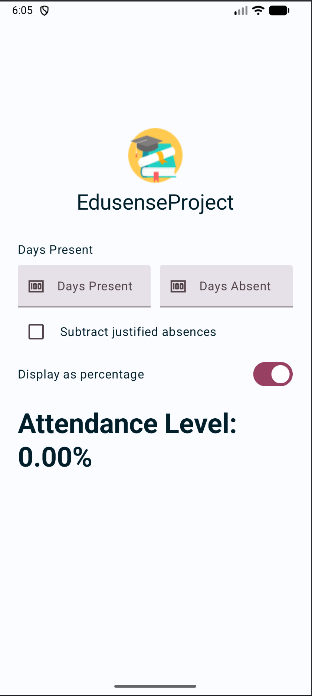
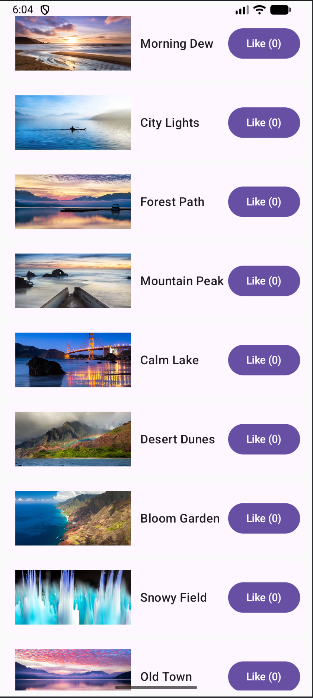

# Mobile Development CA1

Welcome to the repository for the Mobile Development CA1!  
This project contains sample Kotlin Android applications submitted for the first Continuous Assessment (CA1) in Mobile Development. The repo includes practice apps that demonstrate a variety of modern Android development concepts, with a focus on Jetpack Compose, UI design, and basic app architecture.

## Table of Contents

- [Mobile Development CA1](#mobile-development-ca1)
  - [Table of Contents](#table-of-contents)
  - [Apps Included](#apps-included)
    - [Attendance App](#attendance-app)
    - [Scrollable List App](#scrollable-list-app)
  - [Tech Stack](#tech-stack)
  - [Features](#features)
  - [Getting Started](#getting-started)
  - [Screenshots](#screenshots)

---

## Apps Included

### Attendance App
A simple app to track attendance, showing percentage attendance, excused absences, and an interactive UI for input.  
Main features:
- Input days present, absent, and excused
- Option to subtract excused absences
- Attendance percentage calculation
- Modern Compose UI

### Scrollable List App
An app demonstrating a scrollable card-based list using Jetpack Compose.  
Main features:
- List of sample items with title, subtitle, and image
- Expand/collapse cards to show subtitles
- Custom Material 3 theming

---

## Tech Stack

- **Kotlin**
- **Jetpack Compose**
- **AndroidX**
- **Material Design 3**
- **JUnit & Android Instrumented Tests**

---

## Features

- Compose-based UI design
- Custom themes and typography
- Splash screen implementation
- Higher-order functions in Kotlin (for list operations)
- Instrumented UI tests with JUnit

---

## Getting Started

1. **Clone the repository**
   ```bash
   git clone https://github.com/HenriqueJoanoni/mobile-development-ca1.git
   ```

2. **Open with Android Studio**
    - Import the project as an existing Android project.
    - Make sure to update/resolve dependencies as prompted.

3. **Build and Run**
    - Choose either `attendance-app` or `ScrollableList` module to run on an emulator or device.

---

## Screenshots

| Attendance UI | Scrollable List |
|:-------------:|:--------------:|
|  |  |

---
